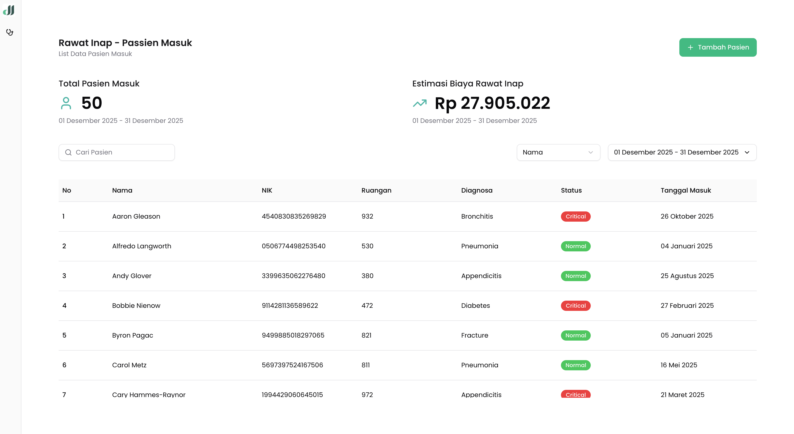

# Inpatient Management System

A modern web application for managing inpatient admissions (Rawat Inap - Pasien Masuk) built with Next.js 15 and TypeScript. This project is a frontend recruitment test for Data Integrasi Inovasi.


## 📸 Screenshots



## ✨ Features

- **Patient Management**: Create, view, and manage inpatient admissions
- **Patient Status Tracking**: Monitor patient status (normal, warning, critical)
- **Filtering & Search**: Filter patients by various criteria
- **Form Validation**: Robust form validation using Zod and React Hook Form
- **Responsive Design**: Modern, mobile-friendly UI built with Tailwind CSS
- **State Management**: Efficient state management with Zustand
- **Data Fetching**: Optimized data fetching with React Query
- **Type Safety**: Full TypeScript support for type-safe development

## 🛠️ Tech Stack

### Core
- **Next.js 15.5.9** - React framework with App Router
- **React 19.1.0** - UI library
- **TypeScript 5.0** - Type safety

### UI & Styling
- **Tailwind CSS 4.0** - Utility-first CSS framework
- **Radix UI** - Accessible component primitives
- **Lucide React** - Icon library
- **shadcn/ui** - Re-usable component library

### State & Data
- **Zustand 5.0.9** - Lightweight state management
- **TanStack Query 5.90.12** - Data fetching and caching
- **React Hook Form 7.69.0** - Form state management
- **Zod 4.2.1** - Schema validation

### Development Tools
- **Biome 2.2.0** - Fast linter and formatter
- **pnpm** - Fast, disk space efficient package manager

## 🚀 Getting Started

### Prerequisites

- Node.js 20.x or higher
- pnpm (recommended) or npm/yarn

### Installation

1. Clone the repository:
```bash
git clone <repository-url>
cd my-app
```

2. Install dependencies:
```bash
pnpm install
```

3. Run the development server:
```bash
pnpm dev
```

4. Open [http://localhost:3000](http://localhost:3000) in your browser.

## 📜 Available Scripts

- `pnpm dev` - Start development server with Turbopack
- `pnpm build` - Build production bundle with Turbopack
- `pnpm start` - Start production server
- `pnpm lint` - Run Biome linter
- `pnpm format` - Format code with Biome

## 📁 Project Structure

```
my-app/
├── src/
│   ├── app/                    # Next.js App Router pages
│   │   ├── layout.tsx         # Root layout
│   │   ├── page.tsx           # Home page
│   │   └── globals.css        # Global styles
│   ├── components/            # Reusable components
│   │   ├── layouts/          # Layout components
│   │   │   ├── app-sidebar.tsx
│   │   │   ├── main-layout.tsx
│   │   │   └── query-provider.tsx
│   │   └── ui/               # UI components (shadcn/ui)
│   │       ├── button.tsx
│   │       ├── dialog.tsx
│   │       ├── form.tsx
│   │       ├── input.tsx
│   │       ├── table.tsx
│   │       └── ...
│   ├── features/             # Feature modules
│   │   └── inpatient/       # Inpatient management feature
│   │       ├── components/  # Feature-specific components
│   │       │   ├── inpatient-filter.tsx
│   │       │   ├── inpatient-form.tsx
│   │       │   ├── inpatient-header.tsx
│   │       │   └── inpatient-table.tsx
│   │       ├── inpatient-constant.ts
│   │       ├── inpatient-service.ts
│   │       ├── inpatient-store.ts
│   │       ├── inpatient-toolkit.ts
│   │       └── inpatient-types.ts
│   ├── hooks/               # Custom React hooks
│   │   └── use-mobile.ts
│   └── lib/                 # Utility functions
│       ├── format.ts
│       └── utils.ts
├── public/                  # Static assets
├── biome.json              # Biome configuration
├── components.json         # shadcn/ui configuration
├── next.config.ts          # Next.js configuration
├── package.json            # Dependencies and scripts
├── postcss.config.mjs      # PostCSS configuration
└── tsconfig.json           # TypeScript configuration
```

## 🏗️ Architecture

### Feature-Based Structure
The application follows a feature-based architecture where each feature is self-contained with its own:
- Components
- Types
- Services (API calls)
- Store (state management)
- Constants (schemas, configurations)

### State Management
- **Zustand** for global application state
- **React Query** for server state and caching
- **React Hook Form** for form state

### Form Validation
Forms are validated using Zod schemas, providing type-safe validation both at runtime and compile-time.

## 🎨 UI Components

The project uses shadcn/ui components built on top of Radix UI primitives, ensuring:
- Accessibility (a11y) compliance
- Customizable styling with Tailwind CSS
- Type-safe component APIs

## 📝 Code Quality

- **Biome** for linting and formatting
- **TypeScript** for type safety
- Consistent code style across the project

## 🤝 Contributing

This is a recruitment test project. For contributions, please follow the existing code style and architecture patterns.

## 📄 License

This project is private and proprietary.

---

Built with ❤️ using Next.js and TypeScript
